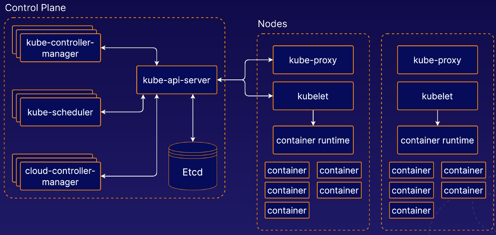

## Kubernetes components

- Control Plane:
    - A collection of multiple components responsible for managing the cluster itself globally.
    - Usually run on dedicated controller machines.
- Nodes
  - kubelet