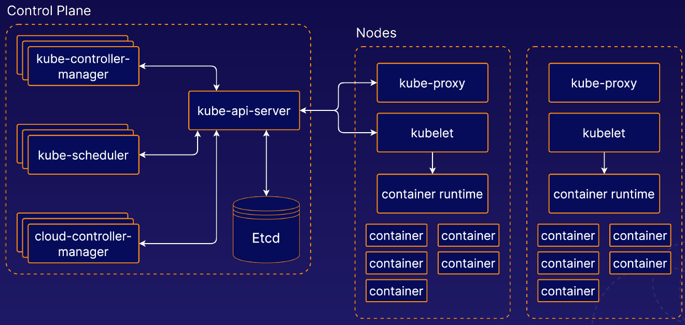

# Getting started
## Kubernetes architectural overview

- Control Plane:
    - A collection of multiple components responsible for managing the cluster itself globally.
    - Usually run on dedicated controller machines.
    - Components
      - kube-api-server: the primary interface to the control plane and the cluster itself.
      - Etcd: the HA backend data store for the Kubernetes cluster.
      - kube-scheduler selects available nodes on which to run containers.
      - kube-controller-manager runs a collection of multiple controller utilities in a single process
      - cloud-controller-manager provides an interface between Kubernetes and various cloud platforms (optional).
- Nodes: the machines where the containers managed by the cluster run. A cluster can have any number of nodes.
  - kubelet: the Kubernetes agent that runs on each node.
    - Communicates with the control plane and ensures that containers are run on its node as instructed by the control plane.
    - Reports container data (e.g. status) back to the control plane.
  - container runtime:
    - not built into Kubernetes
    - responsible for actually running containers on the machine.
    - popular container runtimes are Docker and containerd.
  - kube-proxy is a network proxy, provides networking between containers and services in the cluster.