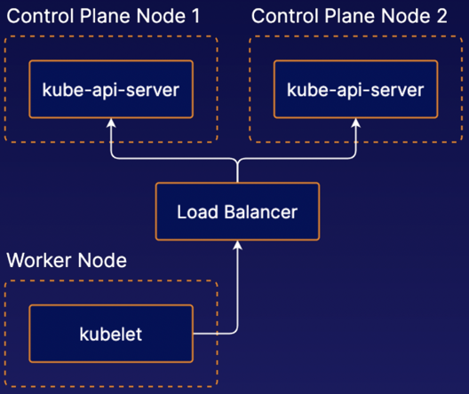

<!-- TOC -->
* [Getting started](#getting-started)
  * [Kubernetes architectural overview](#kubernetes-architectural-overview)
  * [Building a Cluster With kubeadm](#building-a-cluster-with-kubeadm)
* [K8s Management Overview](#k8s-management-overview)
  * [Introduction to High Availability in K8s](#introduction-to-high-availability-in-k8s)
<!-- TOC -->

# Getting started
## Kubernetes architectural overview

- Control Plane:
    - A collection of multiple components responsible for managing the cluster itself globally.
    - Usually run on dedicated controller machines.
    - Components
      - kube-api-server: the primary interface to the control plane and the cluster itself.
      - Etcd: the HA backend data store for the Kubernetes cluster.
      - kube-scheduler selects available nodes on which to run containers.
      - kube-controller-manager runs a collection of multiple controller utilities in a single process
      - cloud-controller-manager provides an interface between Kubernetes and various cloud platforms (optional).
- Nodes: the machines where the containers managed by the cluster run. A cluster can have any number of nodes.
  - kubelet: the Kubernetes agent that runs on each node.
    - Communicates with the control plane and ensures that containers are run on its node as instructed by the control plane.
    - Reports container data (e.g. status) back to the control plane.
  - container runtime:
    - not built into Kubernetes
    - responsible for actually running containers on the machine.
    - popular container runtimes are Docker and containerd.
  - kube-proxy is a network proxy, provides networking between containers and services in the cluster.

## Building a Cluster With kubeadm

- `kubeadm is a tool that simplifies the process of building Kubernetes clusters.
  - The `kubeadm init` command initializes a control plane.
    - `kubeadm init --config my-config.yml` to pass a yaml file containing cluster custom configuration
    - kubeadm performs a series of preflight checks to verify that the current environment is suitable for creating or joining to a cluster.
      - By default, kubeadm will halt execution if any of these preflight checks fails.
      - `kubeadm init --ignore-preflight-errors all` to ignore such errors
  - The `kubeadm join` command can be used to join a new node to the cluster.
- Networking add-on: required for a cluster to become fully functional; installed after cluster initialized; example: Calico.

# K8s Management Overview

## Introduction to High Availability in K8s

- HA Control Plane:

