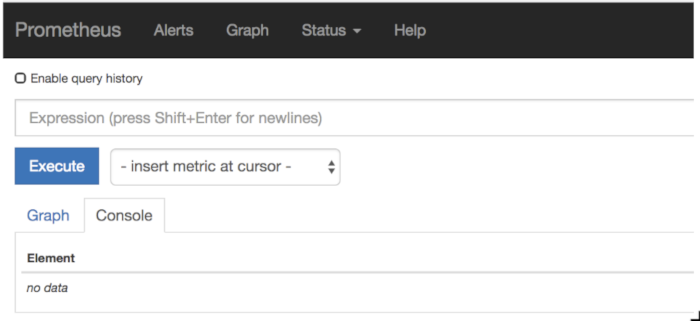
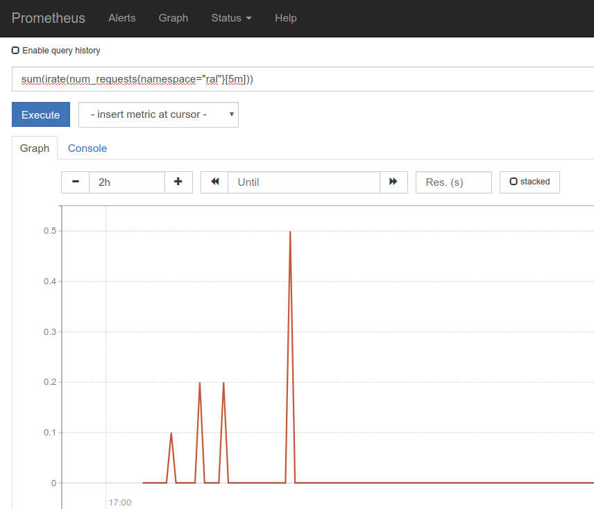

# Docker / Kubernetes - TP6 : Limitations des ressources et métriques
> **Objectifs du TP** :
>- Mettre en œuvre les mécanismes d’_autoscalling_ de Kubernetes
>- Manipuler les limitations de ressources
>- Exposer et récupérer des métriques via Prometheus
>
> **Niveau de difficulté** :
> Intermédiaire

## 1- Introduction

Dans ce TP, nous allons manipuler les limitations de ressources sur notre cluster et exposer les métriques de notre kubernetes-application qui seront récupérées par Prometheus.

## 2- Autoscaling

Pour commencer, nous allons modifier notre code afin que notre application devienne un peu plus gourmande sur sa consommation de CPU.

```py
# kubernetes-app/app.py
import time                  # <== Ajout

from flask import Flask
from http import HTTPStatus
from werkzeug.exceptions import HTTPException

from threading import Thread # <== Ajout

app = Flask(__name__)

def compute():                             # <== Ajout
    timeNow = int(round(time.time()))      # <== Ajout
    timeToStop = timeNow + 200             # <== Ajout
    while timeToStop > timeNow:            # <== Ajout
        99 * 99                            # <== Ajout
        timeNow = int(round(time.time()))  # <== Ajout

@app.route('/')
def hello():
    return 'Hello, Kubernetes!'

@app.route("/config")
def config():
    with open('/etc/config/message','r') as f:
        return f.read()

@app.route("/healthz")
def healthz():
    return "Tutto bene !"

@app.route("/slow")                # <== Ajout
def slow():                        # <== Ajout
    t = Thread(target=compute)     # <== Ajout
    t.start()                      # <== Ajout
    return "CPU is going to heat"  # <== Ajout

@app.errorhandler(HTTPException)
def handle_http_exception(exception: HTTPException):
    return exception.description, exception.code

@app.errorhandler(Exception)
def handle_exception(exception: Exception):
    return HTTPStatus.INTERNAL_SERVER_ERROR.description, HTTPStatus.INTERNAL_SERVER_ERROR

```

Préparons une version **v0.4** en adaptant le fichier `docker-compose.yml` :

```yaml
# kubernetes-app/docker-compose.yml
---
version: '3'
services:
  app:
    build: .
    image: "$REGISTRY_URL/$TRG/app:v0.4" # <== Mise à jour de la version
    ports:
    - "8000:8000"
```

Faisons en sorte que cette nouvelle version soit poussée sur notre registry en version **v0.4** :

```sh
dev $ docker compose build
dev $ docker compose push
```

Ceci étant fait, notre application va désormais lancer un thread de calcul à chaque appel de la route `/slow`. Déployons cette nouvelle version dans notre cluster Kubernetes. Nous allons également modifier le ***deploy*** pour lancer deux instances. Toutes ces modifications doivent être faites dans le fichier `deployment-kubernetes-app.yaml` :

```yaml
# deployment/deployment-kubernetes-app.yaml
---
apiVersion: apps/v1
kind: Deployment
metadata:
  name: kubernetes-app
  labels:
    app: kubernetes-app
spec:
  replicas: 2                                # <== Modif
  selector:
    matchLabels:
      app: kubernetes-app
  template:
    metadata:
      labels:
        app: kubernetes-app
    spec:
      volumes:
      - name: config-volume
        configMap:
          name: myapp-config
      containers:
      - name: kubernetes-app
        image: 261407191094.dkr.ecr.eu-west-3.amazonaws.com/gula/app:v0.4 # <== Modif version
        env:                                 # <== Ajout
        - name: GUNICORN_CORES               # <== Ajout
          valueFrom:                         # <== Ajout
            resourceFieldRef:                # <== Ajout
              containerName: kubernetes-app  # <== Ajout
              resource: limits.cpu           # <== Ajout
        ports:
        - containerPort: 8000
          name: http
        livenessProbe:
          httpGet:
            path: /healthz
            port: 8000
          initialDelaySeconds: 3
          periodSeconds: 5
        readinessProbe:
          httpGet:
            path: /healthz
            port: 8000
          initialDelaySeconds: 3
          periodSeconds: 5
        volumeMounts:
        - name: config-volume
          mountPath: /etc/config
      imagePullSecrets:
      - name: regsec
```


Si on lance la commande `kubectl top po` immédiatement après le lancement des ***pods***, nous n’allons rien voir apparaître. Au bout de quelques dizaines de secondes, les informations sur nos ***pods*** s’affichent.

```sh
dev $ kubectl top po
NAME                                         CPU(cores)   MEMORY(bytes)
kubernetes-app-7664cdc978-4nnnc              0m           28Mi
kubernetes-app-7664cdc978-cmpgx              0m           28Mi
```

> **Questions**
>- Pourquoi les informations ne sont-elles pas immédiatement disponibles ?
>- Que constatons-nous ?

Nous allons à présent mettre en place un mécanisme de _scaling_ horizontal de notre ***deployment*** :

```sh
dev $ kubectl autoscale --min=2 --max=5 deploy/kubernetes-app
deployment "kubernetes-app" autoscaled
```

Prenons quelques minutes pour observer le comportement de notre système en utilisant régulièrement par exemple la commande `kubectl describe rs,deploy,hpa`.

Si la page `/slow` n’est pas requêtée, notre application ne consommera pas énormément de CPU :

Depuis votre navigateur, ouvrez l’adresse correspondant à la route http://kubernetes-app-gula.52.47.206.36.ip.aws.octo.training/slow puis rechargez plusieurs fois cette page.

Afin d’observer l’_autoscaling_ de votre application, ouvrez plusieurs instances de terminal sur votre machine et entrez les commandes suivantes :
```sh
dev $ watch kubectl get pods
```
```sh
dev $ watch kubectl top po
```
> **Questions**
>- Quel est le seuil de déclenchement de l’_autoscaling_ ?
>- Pourquoi l’_autoscaling_ ne se fait-il pas immédiatement ?
>- Quelles sont les valeurs de requests et de limits posées sur vos ***pods*** ?
>- Sachant que vous ne les avez pas précisées, comment sont-elles apparues ?

> **Exercice**
>
> Éditer les composants créés pour obtenir au **minimum 1** et au **maximum 3** ***pods*** ayant le droit de consommer **70m cpu chacun au maximum**.
>
>_(il est probable que la modification de **deux objets** soit nécessaire pour cela)_


## 3- Limitations au sein d’un namespace

Observons les quotas qui sont en place sur vos namespaces :

```sh
dev $ kubectl describe ns $TRG
Name:         gula
Labels:       <none>
Annotations:  <none>
Status:       Active

Resource Quotas
 Name:                         quota
 Resource                      Used  Hard
 --------                      ---   ---
 count/configmaps              1     10
 count/deployments.apps        1     10
 count/persistentvolumeclaims  0     5
 count/pods                    5     10
 count/replicasets.apps        8     20
 count/replicationcontrollers  0     0
 count/services                1     10
 limits.cpu                    50m   2
 limits.memory                 250M  2Gi
 requests.cpu                  5m    1
 requests.memory               10M   1Gi

Resource Limits
 Type       Resource  Min  Max  Default Request  Default Limit  Max Limit/Request Ratio
 ----       --------  ---  ---  ---------------  -------------  -----------------------
 Container  cpu       -    -    1m               100m           -
 Container  memory    -    -    2M               50M            -
```

Nous allons à présent vérifier que nous ne parvenons pas à sortir du quota qui nous a été attribué en créant puis appliquant le fichier suivant (dans le dossier  `~/gula/deployment/`):

```yaml
# deployment/test-deployment-quota.yaml
---
apiVersion: apps/v1
kind: Deployment
metadata:
  name: metrics-app
spec:
  replicas: 12
  selector:
    matchLabels:
      app: metrics-app
  template:
    metadata:
      labels:
        app: metrics-app
    spec:
      containers:
      - name: metrics-app
        image: arnaudmz/metrics-app:1.6
```
```sh
dev $ kubectl apply -f test-deployment-quota.yaml
deployment "metrics-app" created
```

> **Questions**
>- Avons-nous obtenu nos 12 ***pods*** ?
>- A l’aide de `kubectl get/describe deploy/po/events/rs`, trouvez quel composant se fait bloquer. Quelle en est la raison ?

Une fois ce rapide test effectué, vous pouvez supprimer ce ***deployment*** (notez que l'on peut appeler la commande `kubectl delete -f` avec un fichier en paramètre) :

```sh
dev $ kubectl delete -f test-deployment-quota.yaml
deployment.apps "metrics-app" deleted
```

## 4- Métriques applicatives

La limitation des ressources ne vous empêche pas de monitorer votre application. Avec **Prometheus**, nous avons une solution élégante et dynamique qui va nous permettre de surveiller voire d’alerter sur des métriques classiques ou personnalisées.

Par chance, notre cluster possède déjà cette stack de monitoring disponible au sein du namespace monitoring. Elle est elle-même bien entendu conteneurisée. L’interface Prometheus qui nous intéresse se trouve à l’adresse http://prometheus.52.47.206.36.ip.aws.octo.training. Vous l’avez deviné, vos formateurs ont créé une ***ingress*** pour l’exposer…

Vous devriez trouver une page qui ressemble à ça :



> **Exercice**
>
> Prenez un peu de temps pour naviguer dans les menus de Prometheus. Regardez attentivement le sous menus ***targets*** situé dans le menu déroulant ***status***.


Ce qui va nous intéresser maintenant, c’est de modifier notre application Kubernetes afin qu’elle puisse tirer parti de **Prometheus**. Pour cela, nous allons une fois encore devoir faire quelques modifications à plusieurs endroits.

Ouvrez votre fichier `app.py` et modifiez-le pour importer les bibliothèques liées à l’utilisation de Prometheus. L’objectif est de voir comment créer quelques métriques qui peuvent nous intéresser comme, par exemple, le nombre de requêtes sur la route `/` et `/config`.

```py
# kubernetes-app/app.py
import time

from flask import Flask
from http import HTTPStatus
from werkzeug.exceptions import HTTPException

from threading import Thread
from prometheus_client import start_http_server, Counter # <== Ajout

app = Flask(__name__)
num_requests = Counter("num_requests", "Example counter") # <== Ajout

def compute():
    timeNow = int(round(time.time()))
    timeToStop = timeNow + 200
    while timeToStop > timeNow:
        99 * 99
        timeNow = int(round(time.time()))

@app.route('/')
def hello():
    num_requests.inc()                                    # <== Ajout
    return 'Hello, Kubernetes!'

@app.route("/config")
def config():
    num_requests.inc()                                    # <== Ajout
    with open('/etc/config/message','r') as f:
        return f.read()

@app.route("/healthz")
def healthz():
    return "Tutto bene !"

@app.route("/slow")
def slow():
    t = Thread(target=compute)
    t.start()
    return "CPU is going to heat"

@app.errorhandler(HTTPException)
def handle_http_exception(exception: HTTPException):
    return exception.description, exception.code

@app.errorhandler(Exception)
def handle_exception(exception: Exception):
    return HTTPStatus.INTERNAL_SERVER_ERROR.description, HTTPStatus.INTERNAL_SERVER_ERROR

start_http_server(9001)                                   # <== Ajout
```

Cette bibliothèque doit en plus être installée en dépendance. Pour cela, il faut modifier le fichier `requirements.txt` pour qu’il ressemble à cela :

```sh
# kubernetes-app/requirements.txt
Flask==2.0.3
gunicorn==19.9.0
Jinja2==3.1.1
prometheus-client==v0.3.1 # <== Ajout
```

> **Exercice**
>
> Maintenant que vous commencez à en avoir l’habitude :
>- Créez une nouvelle version de votre image en version **v0.5**
>- Poussez-la sur la registry.
>- Modifiez votre `deployment-kubernetes-app.yaml` et appliquez-le à votre cluster afin de mettre à jour l’application.

Notre application modifiée, poussée, et déployée, il nous reste quelques étapes pour que nos métriques apparaissent dans **Prometheus**. Nos métriques seront disponibles via la route /metrics sur un port séparé (le 9001). Pour y accéder, nous allons devoir mettre à jour le ***service*** correspondant à notre application (rappelez-vous, le ***service*** est la **ressource Kubernetes** nous permettant d’accéder via un load-balancer à nos ***pods***).

Créons un second service qui va pointer sur ce port 9001. Créons un fichier `kubernetes-app-prom-svc.yaml` (dans le dossier  `~/gula/deployment/`) avec le contenu suivant :

```yaml
# deployment/kubernetes-app-prom-svc.yaml
---
apiVersion: v1
kind: Service
metadata:
  labels:
    app: kubernetes-app
  name: kubernetes-app-prom
spec:
  ports:
  - name: metrics
    port: 9001
    protocol: TCP
    targetPort: 9001
  selector:
    app: kubernetes-app
  type: ClusterIP
```

```sh
dev $ kubectl apply -f kubernetes-app-prom-svc.yaml
service/kubernetes-app-prom created
```

Il est intéressant de noter qu’un ***service*** peut exposer **plusieurs ports**. Nous avons ici pris le parti d’en créer un second, qui est d’un autre type : ***ClusterIP***.

Comme nous allons chercher à valider que ce port renvoie bien le contenu avant de passer à la suite, il va falloir utiliser la commande `kubectl port-forward` :

```sh
dev $ kubectl port-forward svc/kubernetes-app-prom 9001
```

Nous venons de démarrer en tâche de fond un tunnel qui nous ramène localement sur la machine de dev l’accès au port 9001 de nos ***pods***.

> **Exercice**
>
> Ouvrir un terminal et trouver la commande à base de `curl` pour vérifier que l’URL `/metrics` renvoie bien le contenu attendu

Nous y sommes presque ! Nous devons fournir un dernier effort. Il faut notifier Prometheus qu’une nouvelle application est disponible et qu’elle expose une page de métriques. Pour cela, nous allons utiliser une nouvelle ressource : le ***ServiceMonitor***. Il est important de préciser ici que ce n’est pas une ressource standard qui est présente dans tous les clusters Kubernetes.

Petite explication : Kubernetes offre la possibilité de créer des ressources customisées nommées ***crd*** (pour  ***CustomResourceDefinition***). Celles-ci nous permettent d’étendre l’API Kubernetes à notre guise et l’on pourrait très bien imaginer une nouvelle ressource ***formation*** qui deviendrait accessible via la commande `kubectl get formation` (quoi, vous n’avez pas souscrit de cette manière ?).

Créez un fichier `servicemonitor.yaml` (dans le dossier  `~/gula/deployment/`) et copiez-y les lignes suivantes :

```yaml
# deployment/servicemonitor.yaml
---
apiVersion: monitoring.coreos.com/v1
kind: ServiceMonitor
metadata:
  labels:
    k8s-app: prometheus
  name: kubernetes-application
spec:
  endpoints:
  - interval: 10s
    port: metrics
  namespaceSelector:
    matchNames:
    - gula
  selector:
    matchLabels:
      app: kubernetes-app
```

Donnez ce fichier à votre client `kubectl` pour intégrer ce ***ServiceMonitor*** :

```sh
dev $ kubectl apply -f servicemonitor.yaml
```

C’est fait, retournez dans votre navigateur et regardez de nouveau vos targets. Votre application est désormais monitorée par Prometheus. Félicitations !

Pour aller un peu plus loin :
Allez dans le menu **graph** et faites une recherche sur le nombre de requêtes faite à votre application (`num_requests`). Vous pourrez voir le nombre de requêtes par ***pod***. En imaginant que vous n’êtes pas la seule application à afficher ce type de métrique, vous pouvez tout à fait filtrer et faire la somme de ces métriques en entrant la requête suivante:

`sum(irate(num_requests{namespace="gula"}[5m]))`

Vous devriez trouver un graphe qui ressemble à ça :



## 5- Conclusion

Avec ces dernières étapes, nous avons une application versionnée avec :
- Une configuration dynamique
- Des mécanismes de vérification du bon fonctionnement de nos ***pods*** avec les readiness et liveness probes
- Une exposition sur Internet via les ***ingress***
- Une surveillance de la consommation des ressources via les quotas
- Un début de monitoring

Notre application est désormais un peu plus « _production ready_ ».

… Et si votre formateur a oublié de vous faire une démo des dashboards Grafana, c’est le moment de le relancer !

## 6- Question bonus

Vous aurez peut-être remarqué que nous vous avons demandé (à dessein) d’ajouter une variable d’environnement dans la définition de votre ***deployment*** (chapitre 2 sur l’_autoscaling_).

> **Questions**
>- À quoi correspond la variable `$GUNICORN_CORES` ?
>- Comment est-elle utilisée ?
