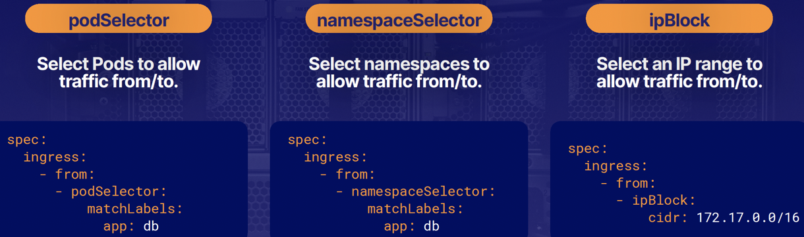

<!-- TOC -->
    * [General](#general)
    * [Create pods](#create-pods)
    * [Test a pod](#test-a-pod)
    * [Pods, containers and storage](#pods-containers-and-storage)
    * [Create other resources](#create-other-resources)
    * [Update resources](#update-resources)
    * [Debugging](#debugging)
    * [Delete / replace resources](#delete--replace-resources)
    * [Secrets for ServiceAccount](#secrets-for-serviceaccount)
    * [Networking, services, DNS](#networking-services-dns)
    * [Cluster](#cluster)
    * [Helm](#helm)
    * [etcd](#etcd)
<!-- TOC -->

### General
- In Mousepad, prepare these setup commands:
```
git clone https://github.com/glahitette/kubernetes
cd kubernetes/
chmod +x bashrc_append.sh
./bashrc_append.sh
```
- To assume root privileges: `sudo -i` (only applies to ACG server setup?)
- Use `grep -A2 Mounts` to show two lines after the line matching `Mounts`
- Select the `acgk8s` cluster to interact: `k config use-context acgk8s`
- Watch pods / deployments / jobs: `k get pods -w` / `k get deployments -w` / `k get jobs -w`
- Repeat command every n seconds, example: `watch -n 2 kubectl get pods`
- Check all resources [in all namespaces]: `k get all [-A]`
- List k8s "internal" pods, sorted by node name: `k get pods -n kube-system --sort-by .spec.nodeName`
- List of resources: `k api-resources`
- API e.g. for pod manifests : `k explain pods[.child1.child2] | more`

### Create pods
- Create an nginx pod: `k run my-pod --image=nginx:alpine [--port=80] [’--labels app=my_app]`
- Create a busybox pod: `k run my-pod --image=busybox $do --command -- sh -c "touch /tmp/ready && sleep 1d" > my-pod.yml`
  - Command YAML syntax example: `command: ['sh', '-c', 'while true; do echo success > /output/output.log; sleep 5; done']`
- Create a throw-away, interactive pod with busybox | netshoot: `k run my-pod --image=(busybox | nicolaka/netshoot) --restart=Never --rm -ti`

### Test a pod
- With a command: `k exec my-pod [-c my-container] (-- env ... | -- cat ...)`
- In interactive mode: `k exec my-pod [-c my-container] -ti -- sh`

### Pods, containers and storage
- Startup probes: run at container startup and stop running once they succeed; very similar to liveness probes (which run constantly on a schedule); useful for legacy applications that can have long startup times.
- Readiness probes: used to prevent user traffic from being sent to pods that are still in the process of starting up (e.g. pod STATUS = Running but READY = "0/1")
  - Example: for a service backed by multiple container endpoints, user traffic will not be sent to a particular pod until its containers have all passed readiness checks.
- Pod’s restart policy: Always (by default), OnFailure (restarted only if error code returned), and Never.
- Pod with InitContainer(s) will show "Init(0/n)" in their STATUS during initialisation
- A Mirror Pod represents a Static Pod in the Kubernetes API, allowing you to easily view the Static Pod's status.
- Volumes:
  - A PersistentVolume’s `persistentVolumeReclaimPolicy` determines how the storage resources can be reused when the PersistentVolume’s associated PersistentVolumeClaims are deleted:
    - `Retain`: Keeps all data. This requires an administrator to manually clean up the data and prepare the storage resource for reuse.
    - `Delete`: Deletes the underlying storage resource automatically (only works for cloud storage resources).
    - `Recycle`: Automatically deletes all data in the underlying storage resource, allowing the PersistentVolume to be reused.
  -  `allowVolumeExpansion` property of a **StorageClass**, if set to false (per default), prevents from resizing a PersistentVolumeClaim.

### Create other resources
- Create a job with `k create job my-job --image=busybox $do > job.yml -- sh -c "sleep 2 && echo done"` then check the pod execution (no such thing as starting a Job or CronJob!)
- Create a ConfigMap from a file, with a specific key: `k create configmap my-cm --from-file=index.html=/opt/course/15/web-moon.html`
- Create a secret (with implicit base64 encoding): `k create secret generic my-secret --from-literal user=test --from-literal pass=pwd`
- Create an nginx deployment: `k create deployment my-dep --image=nginx $do > my-dep.yml` (deployment name is used as prefix for pods' name)
- Create a Service...
  - ...to expose a given pod `k expose pod my-pod --name my-svc --port 3333 --target-port 80` (much faster than creating a service and editing it to set the correct selector labels) 
  - ...for an nginx deployment, which serves on port 80 and connects to the containers on port 8000: `k expose deployment nginx --port=80 --target-port=8000 [--type ClusterIp|NodePort|...] [$do]`
- Note: A NodePort Service kind of lies on top of a ClusterIP one, making the ClusterIP Service reachable on the Node IPs (internal and external).
- Create a quota: `k create quota my-quota --hard=cpu=1,memory=1G,pods=2,services=3,replicationcontrollers=2,resourcequotas=1,secrets=5,persistentvolumeclaims=10 [$do]`
- Create Role / ClusterRole to permissions within a namespace / cluster-wide: `k create role my-role --verb=get,list,watch --resource=pods,pods/logs`
- Create RoleBinding / ClusterRoleBinding to connect Roles / ClusterRoles to subjects (users, groups or ServiceAccounts): `k create rolebinding my-rb --role=my-role --user=my-user`
- Create a service account to allow container processes within Pods to authenticate with the K8s API: `k create sa my-sa`

### Update resources
- Add / remove / change a label: `k label pods my-pod app=b` / `k label pods my-pod app-` / `k label pods my-pod app=v2 --overwrite`
- Add a new label tier=web to all pods having 'app=v2' or 'app=v1' labels: `k label po -l "app in(v1,v2)" tier=web`
- Change a pod's image: `k set image my-pod nginx=nginx:1.7.1 [--record]`
- Recreate the pods in a deployment: `k rollout restart deploy my-dep`
- Perform a rolling update (e.g. to change an image): `k edit deployment my-dep` or `k set image deployment my-dep nginx=nginx:1.21.5 [--record]`
- Check rollout status: `k rollout status deployment my-dep`
- Roll back to the previous version: `k rollout undo deployment my-dep`
- Scale a deployment [and record the command (into Annotations > change-cause)]: `k scale deployment my-dep --replicas=5 [--record]`
- Autoscale a deployment, pods between 5 and 10, targetting CPU utilization at 80%: `k autoscale deploy my-dep --min=5 --max=10 --cpu-percent=80`
  - View the Horizontal Pod Autoscalers (hpa): `k get hpa nginx` 

### Debugging
- Use `k get pods [-A] [--show-labels]`: check `STATUS`, `READY` and `RESTARTS` attributes.
- Retrieve a pod status: `k get pod <pod_name> -o json | jq .status.phase`
- Retrieve pod / container logs: `k logs <pod_name> [-c <container_name>] [-p]` (if pod crashed and restarted, -p option gets logs about the previous instance)
- List events for a given namespace / all namespaces: `k get events (-n <my-namespace> | -A)` 
- Show metrics for pods / pod / nodes: `k top pods [--containers] [--sort-by (cpu | memory)] [-l app=b]` / `k top pod -l=XXXX=YYYY` / `k top node [--sort-by (cpu | memory)]`

### Delete / replace resources
- Force replace a resource: `k replace --force -f ./pod.json`
- Delete pods and services using their label: `k delete pods,services -l app=b $now`

### Secrets for ServiceAccount
- If a Secret belongs to a ServiceAccount, it'll have the annotation `kubernetes.io/service-account.name`
- Use `k get secret ...` to get a base64 encoded token 
- Use `k describe secret ...` to get a base64 decoded token...or pipe it manually through `echo <token> | base64 -d -`

### Networking, services, DNS
- The cluster has a single virtual network spanning across all Nodes.
- Kubernetes **nodes** will remain `NotReady`, unable to run Pods, until a network plugin is installed. `Starting kube-proxy` will be shown in the nodes logs and no networking pods will exist.
- Default FQDN:
  - `<pod-ip-address-with-dashes>.<my-namespace>.pod.cluster.local.`
  - `<my-service-name>.<my-namespace>.svc.cluster.local.`
- `from` and `to` selectors:
  
- Example of "deny all" policy for labelled pods:
```
spec:
  podSelector:
    matchLabels:
      app: maintenance
  policyTypes:
    - Ingress
    - Egress
```
- Example of egress policy, 1) restricting outgoing tcp connections from frontend to api, 2) still allowing outgoing traffic on UDP/TCP ports 53 for DNS resolution.
```
spec:
  podSelector:
    matchLabels:
      id: frontend          # label of the pods this policy should be applied on
  policyTypes:
  - Egress                  # we only want to control egress
  egress:
  - to:                     # 1st egress rule
    - podSelector:            # allow egress only to pods with api label
        matchLabels:
          id: api
  - ports:                  # 2nd egress rule
    - port: 53                # allow DNS UDP
      protocol: UDP
    - port: 53                # allow DNS TCP
      protocol: TCP
```
- Example of Network Policy allowing all pods in the `users-backend` namespace to communicate with each other only on a specific port (80): first label the namespace: `k label namespace users-backend app=users-backend` then use:
```
metadata:
  name: np-users-backend-80
  namespace: users-backend
spec:
  podSelector: {} # selects all pods in the specified namespace
  policyTypes:
  - Ingress
  ingress:
  - from:
    - namespaceSelector:
        matchLabels:
          app: users-backend
    ports:
    - protocol: TCP
      port: 80
```
- Example policy containing a single `from` element allowing connections from Pods with the label `role=client` in namespaces with the label `user=alice`
```
  ingress:
  - from:
    - namespaceSelector:
        matchLabels:
          user: alice
      podSelector:
        matchLabels:
          role: client
```
- Example policy containing two elements in the `from` array, allowing connections from Pods in the local Namespace with the label `role=client`, **or** from any Pod in any namespace with the label `user=alice`.
```
  ingress:
  - from:
    - namespaceSelector:
        matchLabels:
          user: alice
    - podSelector:
        matchLabels:
          role: client
```
- When in doubt, `kubectl describe` shows how Kubernetes has interpreted the policy.
- Endpoints are the underlying entities (such as Pods) that a Service routes traffic to.
- Ingress: manages external access to Services; more powerful than a simple NodePort Service (e.g. SSL termination, advanced load balancing, or namebased virtual hosting).

### Cluster
- Drain a node: `k drain [--ignore-daemonsets --force] <node name>`
  - The `kubectl drain` subcommand on its own does not actually drain a node of its DaemonSet pods: the DaemonSet controller (part of the control plane) immediately replaces missing Pods with new equivalent Pods.
  - The DaemonSet controller also creates Pods that ignore unschedulable taints, which allows the new Pods to launch onto a node that you are draining.
- Resume scheduling **new pods** onto the node: `k uncordon <node name>`
- In a cluster built with `kubeadm`:
  - To check the status of cluster components such as kube-apiserver, check the status of (static) Pods in the `kube-system` Namespace (kube-apiserver is not set up as a systemctl service).
  - To find logs for the Kubernetes API Server: `k logs -n kube-system <api-server-pod-name>` (the `/var/log/kube-apiserver.log` log file is not available on the host since the API Server runs in a static Pod).
  - To find kubelet logs: `sudo journalctl -fu kubelet` (kubelet runs as a standard service).
  - To investigate DNS issues, check the DNS Pods in the `kube-system` Namespace.
- To upgrade `kubeadm` clusters: [link](CKA%20training/Upgrading%20kubeadm%20clusters.md)

### Helm
- List release with `helm [-n my_ns] ls [-a]`
- List pending deployments on all namespaces: `helm list --pending -A`
- List / search repo: `helm repo list` / `helm search repo nginx`
- Download (not install) a chart from a repository: `helm pull [chart URL | repo/chartname] [...] [flags]`
- Untar a chart (after downloading it): `helm pull --untar [rep/chartname]`
- Check customisable values setting for an install, e.g. `helm show values bitnami/apache [| yq e]`
- Custom install example `helm install my-apache bitnami/apache --set replicaCount=2`
- Upgrade a release, e.g. `helm upgrade my-api-v2 bitnami/nginx`
- Undo a helm rollout/upgrade: `helm rollback`
- Delete an installed release with `helm uninstall <release_name>`

### etcd
- etcd is a consistent and highly-available key value store used as Kubernetes' backing store for all cluster data.
- Backup / restore etcd data: [link](CKA%20training/etcd.md)

[//]: # (### References)
[//]: # (- https://kubernetes.io/docs/reference/k/cheatsheet/)
[//]: # (- https://github.com/dennyzhang/cheatsheet-kubernetes-A4)
[//]: # (- https://codefresh.io/blog/kubernetes-cheat-sheet/)
[//]: # (- https://intellipaat.com/blog/tutorial/devops-tutorial/kubernetes-cheat-sheet/)